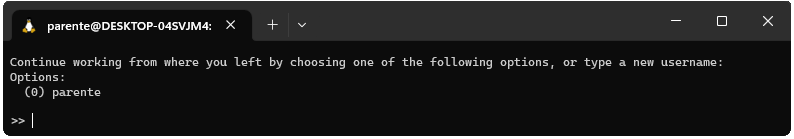
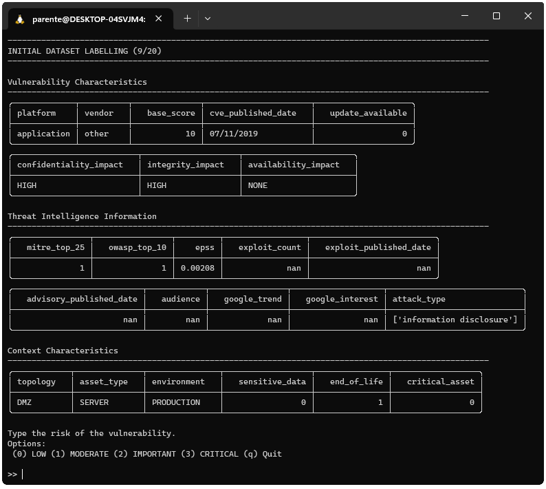

# Active Learning Online Labelling

The main objective of this program is to simulate the online labelling process of vulnerabilities risks using the active learning technique. When using the program, the analyst will be asked to label 4 different sets of vulnerabilities:

 - the initial dataset containing 20 vulnerabilities
 - the test dataset containing 60 vulnerabilities
 - the active learning dataset containing 100 vulnerabilities
 - the random selected dataset containing 100 vulnerabilities

Those values can be configured editing the `main.py` file. The following images represent respectively the `starting screen` and `vulnerability labelling screen` of the program.





For more information about the machine learning techniques tested and the vulnerability risk classification problem, read the paper: [A Vulnerability Risk Assessment Methodology Using Active Learning](https://link.springer.com/chapter/10.1007/978-3-031-28451-9_15), published at the international conference on Advanced Information Networking and Applications. Also, with you would like to know more about the security dataset used in the experiments, you can check the [CVEJoin Security Dataset](https://github.com/rodrigoparente/cvejoin-security-dataset) repository.

## Requirements

Install requirements using the following command

```bash
$ pip install -r requirements.txt
```

## Execute

There are two ways to execute the labelling program.

### Through an executable

First, you need to generate the executable using the following command in UNIX

```bash
$ make build
```

Or the following command in Windows

```bash
$ build.bat
```

Then, double click the executable, inside the folder `minified`, to execute it. 

### Through the CMD

Use the following command

```bash
$ python main.py
```

## Output

The output of the labelling program will be placed at the ``results`` folder.

## License

This project is [GNU GPLv3 licensed](./LICENSE).